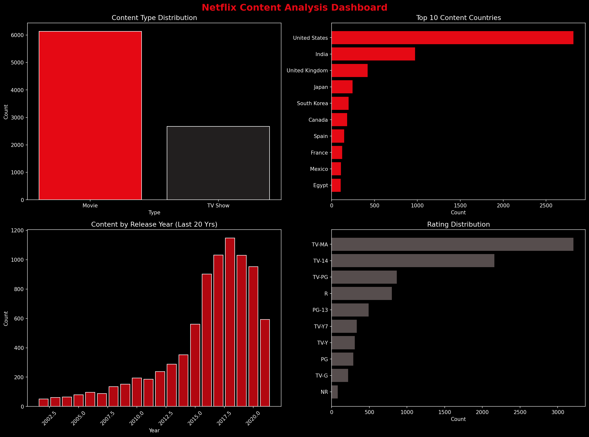

# 🤖 Multi-Agent AI Data Analyst — Netflix

A 5-agent AI pipeline that analyzes 8,807 Netflix titles using CrewAI and Gemini API on Kaggle.

## 🤖 Agent Pipeline
| Agent | Role |
|-------|------|
| 🧹 Agent 1 | Data Cleaning Specialist |
| 📊 Agent 2 | Senior Data Analyst |
| 📈 Agent 3 | Data Visualization Expert |
| 💡 Agent 4 | AI Insights Interpreter |
| 📝 Agent 5 | Technical Report Writer |

## 📊 Netflix Dashboard

## 🔍 Key Findings
- 📽️ Movies dominate (69.6%) but TV shows are growing
- 🌍 US leads but 68% of content is international
- 🔞 TV-MA is #1 rating — Netflix targets adults
- 📈 Content peaked in 2018, slowing post-2020
- 🎭 Drama and International genres dominate

## 🛠️ Tech Stack

## 📁 Project Files
| File | Description |
|------|-------------|
| `notebook.ipynb` | Main Kaggle notebook with all code |
| `netflix_dashboard.png` | 4-chart visual dashboard |
| `netflix_report.md` | Full AI-generated analysis report |
| `requirements.txt` | Required Python libraries |

## ⚙️ How to Run
1. Open Kaggle and create a new notebook
2. Add Netflix dataset from Kaggle datasets
3. Add your Gemini API key in Kaggle Secrets as `GEMINI_API_KEY`
4. Run all cells in order

## 🔗 Links
- 📓 [Kaggle Notebook](https://www.kaggle.com/code/samikshyasaud/multi-agent-ai-data-analyst-netflix-content-anal)
- 📊 [Dataset](https://www.kaggle.com/datasets/shivamb/netflix-shows)

## 👩‍💻 Author
**Samikshya Saud** | BSc CSIT

---
